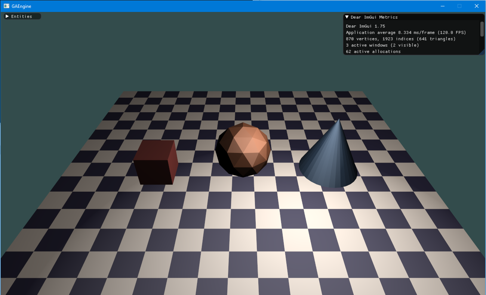

# GAEngine

**C# / OpenGL engine experiment · 2020**

A small C# and OpenGL engine exploring 3D rendering, asset loading,
entity/component architecture and interactive debugging tools. This is an early
learning project, preserved with its original .NET Framework target and library
versions. The public sample and build packaging were tidied up in 2026.



*Historical screenshot from the original project. The current bundled demo uses a
checker-textured cube; it does not reproduce this older scene.*

## Features and project work

- OpenGL mesh rendering with vertex/index buffers, GLSL shaders, depth testing and
  back-face culling.
- Texture mapping, diffuse and specular lighting from a single positional light,
  and perspective camera/transform matrices.
- Model import through AssimpNet, followed by mesh upload to OpenGL. The demo uses
  OBJ; the original experiments also used FBX.
- A small entity/component system with mesh and transform components.
- Keyboard camera movement and ImGui controls for camera position, rotation, field
  of view, light position and texture refresh.

The GAEngine-specific work is the scene loop, renderer and shaders, mesh/texture
loading glue, entity/component organisation, input handling and scene controls.
Windowing, graphics bindings, model decoding and the UI library come from the
dependencies below. The four files in `GAEngine/GAEngine/Gui/` are adapted upstream
integration code; see [credits and third-party notices](THIRD_PARTY_NOTICES.md).

## Requirements

- **Windows x64** for running the sample, with a GPU and driver supporting
  **OpenGL 4.6**. The scene shaders use GLSL 4.60 and the ImGui integration uses
  OpenGL direct-state-access functions. The window requests OpenGL 4.6 explicitly.
- A **.NET SDK** for the command-line build, or the original **Visual Studio 2019**
  setup with the **.NET desktop development** workload and **.NET Framework 4.6.1
  targeting pack**. The solution contains SDK-style projects targeting `net461`.
- A compatible **.NET Framework 4.x runtime** on Windows, such as 4.8. The SDK alone
  does not run .NET Framework executables. .NET Framework 4.6.1 is out of support;
  it is retained here as the project's historical compilation target.
- Internet access on the first build for NuGet restore.

Modern SDKs can restore the framework reference assemblies through NuGet when
the targeting pack is absent. See Microsoft's [reference-assembly build
guide](https://learn.microsoft.com/en-us/dotnet/framework/migration-guide/reference-assemblies)
and [.NET Framework installation and lifecycle
notes](https://learn.microsoft.com/en-us/dotnet/framework/install/guide-for-developers).

## Build and run

From PowerShell on Windows:

```powershell
git clone https://github.com/AyoubGharbi/GAEngine.git
cd GAEngine
dotnet build .\GAEngine\GAEngine.sln --configuration Release
& .\GAEngine\Sandbox\bin\Release\net461\win-x64\Sandbox.exe
```

In Visual Studio 2019, open `GAEngine/GAEngine.sln`, leave the `net461` target
unchanged, set **Sandbox** as the startup project, select **Release / Any CPU**,
restore NuGet packages and start with **Ctrl+F5**. The Sandbox executable is
explicitly built for x64 even under this solution configuration.

The build copies the bundled model, texture, scene shaders and licence notices
beside the executable, and restores/copies the native dependencies. Keep the
**whole output directory**, including its `runtimes` subdirectory, together when
moving the demo. Content paths resolve relative to the executable, so no custom
working directory or manual asset download is needed.

### Expected result and a short demo

The sample should open an 800 × 600 window containing a tilted, teal-and-cream
checker cube, an **Entities** panel and the **Dear ImGui Metrics** window.

1. Use **W / S** briefly to move towards and away from the cube.
2. Expand **Entities** and select **Camera**. Drag the FOV or position sliders to
   show the view updating live.
3. Select **Light** and move the light to show the changing surface illumination.
4. Optionally edit `res/demo/checker.png` **in the build output**, save it, then
   click **Refresh texture**. The button reloads that file from disk.
5. Press **Esc** to close. Restarting restores the default camera and scene.

This sequence also works as a short portfolio recording. The repository currently
contains the historical screenshot above, not a recording of the updated demo.

## Controls

| Input | Action |
| --- | --- |
| W / S | Move the camera along world −Z / +Z |
| A / D | Move the camera along world −X / +X |
| Esc | Close the window |
| Camera → FOV / Position | Adjust perspective or camera position, including height |
| Camera → Rotation X / Rotation Y | Adjust yaw / pitch respectively (legacy labels) |
| Light → Position | Move the scene's white light |
| Refresh texture | Reload the output copy of the sample PNG |

Movement uses fixed steps per update and world axes; there is no mouse-look or
orbit camera. Camera movement pauses while an ImGui control captures keyboard
input. The original Space/left-mouse input fields have no scene action wired up.

## Source layout

| Path | Purpose |
| --- | --- |
| `GAEngine/Sandbox/` | Executable entry point and demo content packaging |
| `GAEngine/GAEngine/ECS/` | World/scene loop, entities and components |
| `GAEngine/GAEngine/RenderEngine/` | Window, model loading, buffer upload and rendering |
| `GAEngine/GAEngine/Shaders/` | Shader loading and uniform handling |
| `GAEngine/GAEngine/Gui/` | Adapted OpenTK/ImGui integration and helpers |
| `GAEngine/GAEngine/Inputs/`, `Handlers/`, `Objects/`, `Textures/`, `Utils/` | Input, component storage, camera, lighting and utilities |
| `shaders/` | Runtime GLSL sources copied into the demo output |
| `res/demo/` | Bundled cube, checker texture and asset notes |
| `tools/generate_demo_assets.py` | Optional standard-library Python asset generator |

To change the sample, edit `DemoModel` / `DemoTexture` and the initial transform in
`ECS/World.cs`, and update the content entries in `Sandbox.csproj` to copy your
files. The mesh must have positions, normals and UVs. The renderer currently uses
only the first imported mesh and an explicitly supplied texture.

## Limitations and troubleshooting

- This is a rendering experiment, with no physics, animation, scene serialisation,
  asset browser or production editor. Component storage and resource lifetime
  management are rudimentary and have not been stress-tested.
- macOS/Linux execution is not supported by this sample. A successful build on
  another OS does not establish runtime support; the output targets Windows x64.
- If context creation or shader compilation fails, check driver support for
  OpenGL 4.6. A virtual machine or remote desktop session may expose a different
  graphics implementation from the local GPU.
- If a content file is missing, rebuild **Sandbox** and retain its `res` and
  `shaders` output folders. Edit the root `shaders/` files for runtime shader
  changes; older copies under the engine project are not loaded by the demo.
- For `DllNotFoundException` or `BadImageFormatException`, rebuild with the supplied
  x64 settings and retain `cimgui.dll` plus `runtimes/win-x64/native/assimp.dll`.
  Do not mix native libraries from different package versions or architectures.
- There is no automated graphics test suite. Build and packaging checks do not
  substitute for running the walkthrough on a Windows machine with OpenGL 4.6.

## Dependencies and licence

The historical versions remain pinned: OpenTK **3.2.0**, AssimpNet **4.1.0**,
ImGui.NET **1.75.0**, and an unused NUnit **3.12.0** reference. There are no NUnit
tests in this repository.

GAEngine is distributed under the [MIT licence](LICENSE). The new demo assets are
generated specifically for this repository and use the same licence. See
[THIRD_PARTY_NOTICES.md](THIRD_PARTY_NOTICES.md) for the ImGui integration's source,
upstream licence notices and dependency credits.
